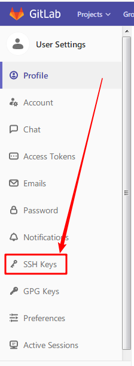
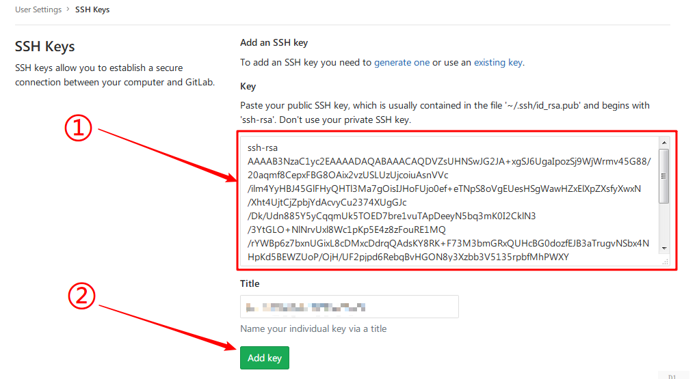

[[_TOC_]]

# 使用 SSH 登录 Gitlab 

本文以 Git 原生的客户端程序为例，讲解如何使用 SSH 登录 Gitlab 的方法。其它客户端，可依此类推。

## 一、创建 SSH 密钥

如果已经有 SSH 密钥对，可以忽略本步骤。如果没有，按照以下方法创建。

1. 打开 git 客户端，键入命令：`ssh-keygen -C "xxx@abc.com" -P "" -f id_rsa.gitlab`

   其中的 email 地址 `xxx@abc.com` ，请用自己的 email 代替。

2. 如下提示，表明创建成功。私钥和公钥文件，都存放在目录 `~/.ssh`下

    其中私钥文件为 `id_rsa.gitlab`，注意保密，不要让别人知道。

    公钥文件为 `id_rsa.gitlab.pub`，后续要上传到 Gitlab 里。

    ```
    Generating public/private rsa key pair.
    Your identification has been saved in id_rsa.gitlab.
    Your public key has been saved in id_rsa.gitlab.pub.
    The key fingerprint is:
    SHA256:pwUjsFTnxgP2f6zzaN0I/sLfhtUrbqaMqfqZl33h4pE xxx@abc.com
    The key's randomart image is:
    +---[RSA 2048]----+
    |    o.+ .        |
    |   . + *         |
    |    . . O        |
    |       o = .     |
    |        S + o  . |
    |         +.o... .|
    |        .o=E.=. .|
    |        ooO*=Bo. |
    |     .o=o+oB@oo  |
    +----[SHA256]-----+
    ```

## 二、本地设置

1. 打开 git 客户端，进入目录`~/.ssh`

2. 创建一个名为 `config` 的文件，如果已经有了，就打开它。

3. 在文件中增加如下内容，其中`xxx@abc.com `请用自己在上一步骤里所使用的 email 代替：

    ```
    Hostname gitlab.abc.com.cn
    Port 2222
    User xxx@abc.com
    IdentityFile ~/.ssh/id_rsa.gitlab
    ```

## 三、Gitlab 设置

1. 登录 Gitlab 的 Web 页面，进入自己的`setting`界面，找到`SSH Keys`设置项：

   

2. 在右边的界面里：

   

   ① 将在第一步里生成的 SSH 公钥文件 `id_rsa.gitlab.pub` 内容，拷贝到 key 内容框里，

   ② 然后按 `Add key` 按钮，加入到 gitlab 系统里。

## 四、使用

登录 Gitlab 的 Web 页面，选取一个项目，如下图：


① 在使用协议一栏，选择 `SSH`

② 然后使用拷贝功能，拷贝链接

③ 然后在客户端，可以使用 `git clone` 命令来复制项目了。

## 参考文档

http://gitlab.com/help/ssh/README
