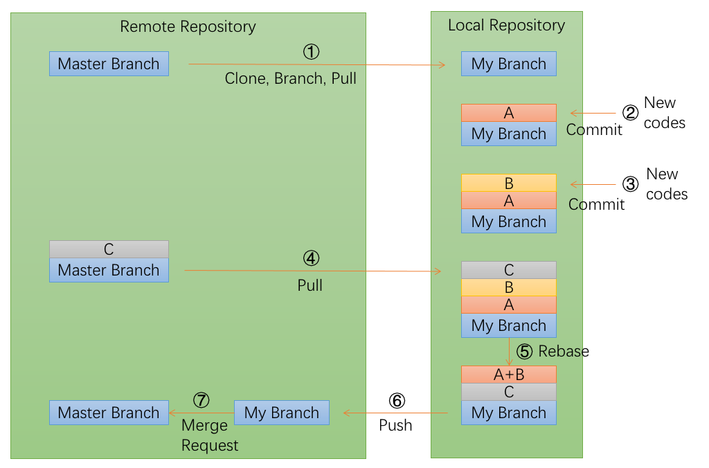

# Git 工作流程

## 流程图



## 流程说明

以下的命令，以原生的 Git 客户端为例。

### ①：新建分支

每次开发新功能，都应该新建一个单独的分支，例如下面命令中的 `myfeature`

```
$ git checkout master
$ git pull
$ git checkout -b myfeature
```

### ②：提交分支commit

在该分支上添加或修改代码，并进行提交 commit。

```
$ git add .
$ git status
$ git commit --verbose
```

git add . 表示保存所有变化（包括新建、修改和删除）。

git status 命令，用来查看发生变动的文件。

git commit 命令的 verbose 参数，会列出 diff 的结果。

### ③：撰写提交信息

提交 commit 时，必须给出完整扼要的提交信息

一般第一行是不超过 50 个字的提要，然后空一行，罗列出改动原因、主要变动、以及需要注意的问题。

### ④：与主干同步

分支的开发过程中，要经常与主干 master 分支保持同步。

```
$ git fetch origin
$ git rebase origin/master
```

或者采用命令：

```
$ git pull origin master --rebase
```

在 rebase 的过程中，有可能因为修改了相同的文件，导致自动 merge 失败，这时候需要手工干预，修正文件后再 rebase。

### ⑤：合并commit

分支开发完成后，很可能有一堆 commit，但是合并到主干的时候，往往希望只有一个（或最多两三个）commit，这样不仅清晰，也容易管理，使用 git rebase 命令，可达到这个目的。

```
$ git rebase -i origin/myfeature
```

rebase 命令的 -i 参数表示互动（interactive），这时 git 会打开一个互动界面，具体的操作就不细说了。

### ⑥：推送到远程仓库

合并 commit 后，就可以推送当前分支到远程仓库了。

```
$ git push --force origin myfeature
```

因为rebase以后，分支历史改变了，跟远程分支不一定兼容，有可能要强行推送，因此要在 git push 命令中加上 force 参数。

### ⑦：发出 Merge Request

提交到远程仓库以后，就可以发出 Merge Request 到 master 分支，然后请求 Owner 进行代码 Review，确认可以合并到 master。

# 参考

http://www.ruanyifeng.com/blog/2015/08/git-use-process.html